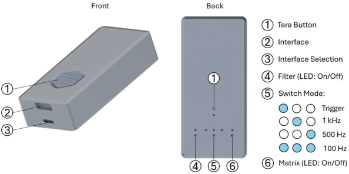

# Resense-HEX Arduino Library
[](https://www.etit.tu-darmstadt.de/must/home_must/index.en.jsp)
[](https://www.arduino.cc/)

A clean, MCU-agnostic Arduino library for communicating with a **Resense HEX** 6-axis Force/Torque Sensor over UART.

## Features

- **MCU Agnostic**: Works with ESP32, ESP32-S3, Arduino Uno/Mega, and any board with `HardwareSerial` / `SofwareSerial` or `Stream` support
- **High Speed**: Full 2 Mbaud UART communication
- **Easy to Use**: Simple `readFrame()` API
- **Well Documented**: Full Doxygen comments, comprehensive examples

## Hardware Requirements
### HEX Sensor Pin Connections

The HEX evaluation electronics box has a 5-pin UART connector which follows the Micro-USB standard:

| Pin | Micro-USB   | Cable Color  | HEX / UART             |
|-----|-------------|--------------|------------------------|
| 1   | VCC (+5V)   | Red          | VCC (+5V)              |
| 2   | D-          | White        | TX (+3.3V)             |
| 3   | D+          | Green        | RX (+3.3V)             |
| 4   | ID          | N/A / Yellow | Trigger (optional)     |
| 5   | GND         | Black        | Ground                 |

** before you start don't forget to move the slide switch from USB to UART ** 

### Level Shifting

If your MCU is **5V-based** (Arduino Uno, Mega), use a level shifter:
- **Option 1**: TTL logic level converter
- **Option 2**: Voltage divider on HEX TX line (RX to MCU)

The 3.3V input (RX) can sometimes tolerate 5V directly due to input clamping, but level shifting is recommended to prevent damage.

### UART Configuration

```
Baud Rate:  2,000,000 bit/s
Data Bits:  8
Parity:     None
Stop Bits:  1
Flow:       None
```

## Installation

### Method 1: Arduino IDE Library Manager (when published)
```
Sketch → Include Library → Manage Libraries
Search: "ResenseHEX"
Install
```

### Method 2: Manual Installation
1. Create folder: `~/Arduino/libraries/ResenseHEX32/`
2. Copy these files into that folder:
   - `ResenseHEX.h`
   - `ResenseHEX.cpp`
3. Restart Arduino IDE

## Quick Start

### Minimal Example

```cpp
#include <HardwareSerial.h>
#include "ResenseHEX32.h"

HardwareSerial SensorSerial(1); // UART Hardware interface 1 // consider SoftwareSerial if none left
ResenseHEX hex(SensorSerial); // create ResenseHEX object by passing a Serial Interface dereived from Stream
ResenseFrame frame; // struct data will be saved to

void setup() {
  Serial.begin(115200);	// PC Serial Interface
  SensorSerial.begin(ResenseHEX::DEFAULT_BAUD, ResenseHEX::DEFAULT_CONFIG, RX_PIN, TX_PIN); // HEX Serial Interface
}

void loop() {
if (hex.meas(frame)) {
    if (hex.validateFrame(frame)) {
		Serial.println(frame.fx);  // Force X
		Serial.println(frame.fy);  // Force Y
		Serial.println(frame.fz);  // Force Z
		Serial.println(frame.mx);  // Torque X
		Serial.println(frame.my);  // Torque Y
		Serial.println(frame.mz);  // Torque Z
		Serial.println(frame.temperature);  / Temperature in °C
		Serial.println(frame.timestamp);  // Timestamp in ms
    } else {
      Serial.print("Exceeds user thresholds -> tare? ");
      hex.tareBlocking();
    }
  } else {
    Serial.println("Timeout or corrupted frame");
}
```

### Details
There are essentially three different modes the Resense sensors can operate under:
1. **Continuous-Mode** (meaning a set frequency) _only pre-defined sample rates_
2. Trigger-Mode
	- **Software-Trigger** (triggered by sending a command over UART) _only single measurements_
	- **Hardware-Trigger** (triggered by a falling edge on Pin 4 / Trigger) _this requires the use of a 5 pin micro usb cable/connector_



| ID | Function           | Description |
|----|--------------------|-------------|
| 1  | Tara               | 🔵 taring available <br>⚪ taring in process <br> Pressing the tara button for more than 20 seconds switches the box to bootloader mode and makes it appear as USB storage on a normal computer; new firmware can then be flashed by dragging and dropping the supplied `.uf2` file, and after a power cycle the new firmware runs on the box. |
| 2  | Interface          | <br>**USB**: The native micro USB interface from the internal RP2040 microcontroller is used to connect the electronics board with the desktop PC (12 Mbit), and the electronics are supplied by 5 V from the USB interface. <br>**UART**: The UART interface is used to communicate with an external microcontroller at 2 Mbit, with the respective pin assignment described in the manual. |
| 3  | Interface Selection| A switch selects USB or UART as the active interface: <br> ⬅️ left switch position corresponds to **USB** <br> ➡️ right switch position corresponds to **UART** |
| 4  | Filter             | Indicates status of filter (moving average of 10 unweighted samples): <br>🔵 filter is enabled <br>⚪ filter is disabled |
| 5  | Switch Mode        | 🔵⚪⚪ Trigger <br>⚪🔵⚪ 1 kHz sampling rate <br>⚪⚪🔵 500 Hz sampling rate <br>🔵🔵🔵 100 Hz sampling rate <br> |
| 6  | Matrix             | An LED indicates whether the calibration matrix is enabled: <br>🔵 output data are forces and torques in the three Cartesian axes in SI units (newtons and millinewton-meters) <br>⚪ output data are raw signals from each axis that do not directly correspond to forces and torques in the Cartesian axes. |

